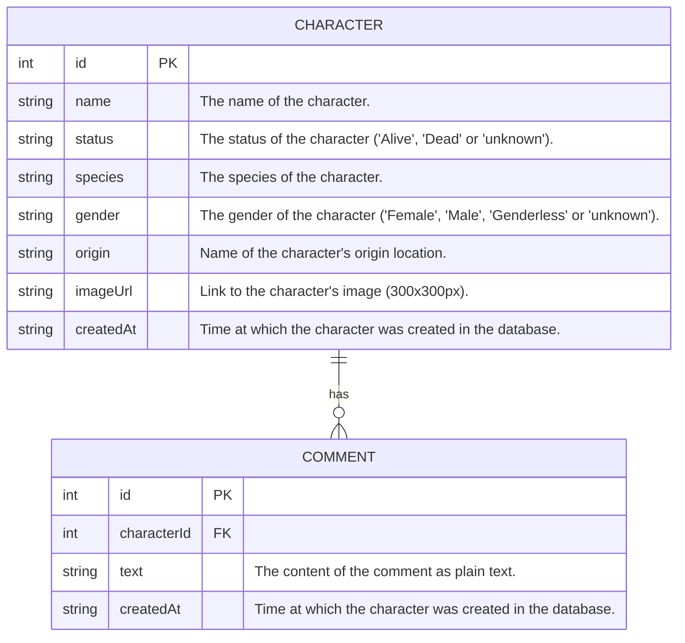

# Rick and Morty

## Features
- Search Character by Status, Species, Gender, and Origin.
- Sort Characters by name (server side or client side, that's the question).
- A Character has Comments.
- A Character can be marked as favorite.
- A Character can be soft-deleted.

## Entity Relationship Diagram


## Run it

### Prerequisites
- Install **Docker** and **Docker Compose**
- Make sure the following ports are available: `4000`, `5432`, `6379`, and `5173`

### Steps

1. **Start the services** (PostgreSQL, Redis, ExpressJS, and ReactJS):

```sh
docker compose -f compose.dev.yml up -d --build
```

2. Enter the backend container:

```sh
docker ps
docker exec -it <container_id> sh
```

3. Run Sequelize migrations and seeders inside the backend container:

```sh
npx sequelize-cli db:migrate
npx sequelize-cli db:seed:all
```

## API

### Query a specific character by ID
```sh
curl -X POST http://localhost:4000/graphql \
  -H "Content-Type: application/json" \
  -d '{"query": "query { character(id: 1) { id name status species origin imageUrl createdAt comments { id text createdAt } } }"}'
```

### Filter characters by name, status, especies, and origin
```sh
curl -X POST http://localhost:4000/graphql \
  -H "Content-Type: application/json" \
  -d '{"query": "query { characters(name: \"Rick\", status: Alive, species: Human, origin: \"Earth\") { id name status species origin } }"}'
```

### Add a comment to a character
```sh
curl -X POST http://localhost:4000/graphql \
  -H "Content-Type: application/json" \
  -d '{"query": "mutation { addComment(characterId: \"1\", text: \"Great character!\") { id text createdAt } }"}'
```
