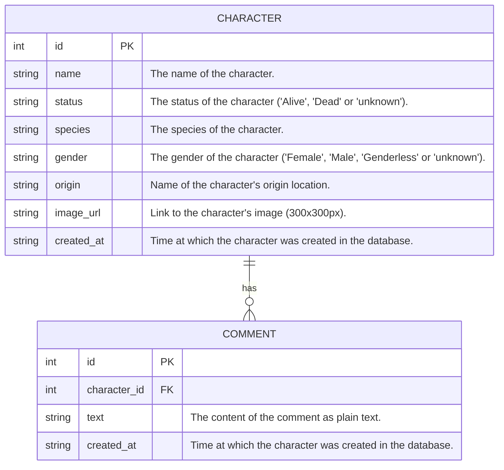

# GraphQL

## Features
- Search Character by Status, Species, Gender, and Origin.
- Sort Characters by name (server side or client side, that's the question).
- A Character has Comments.
- A Character can be marked as favorite.
- A Character can be soft-deleted.

## Entity Relationship Diagram

curl -X POST http://localhost:4000/graphql \
  -H "Content-Type: application/json" \
  -d '{
    "query": "query GetCharacters($name: String, $status: Status) { characters(name: $name, status: $status) { id name } }",
    "variables": { "name": "Rick", "status": "Alive" }
  }'
